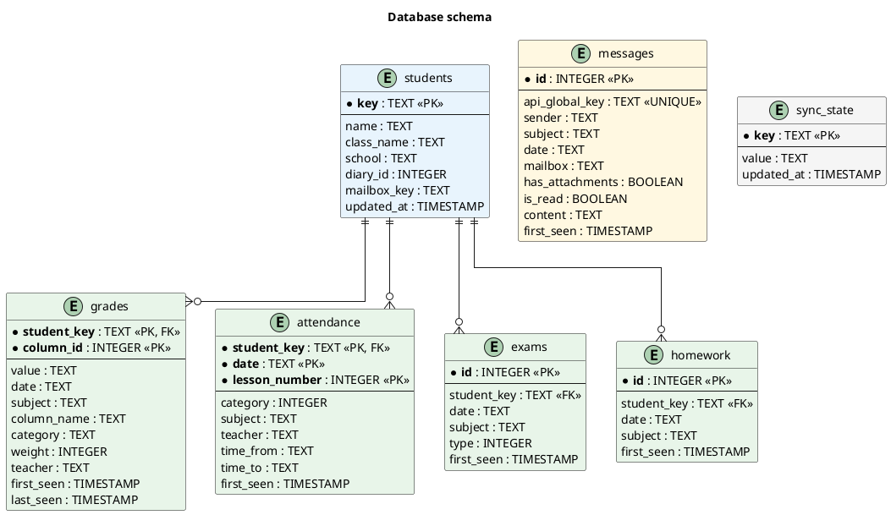

# vulcan-notify

CLI tool that syncs data from the eduVulcan school e-journal to a local SQLite database and shows what changed since the last sync.

Solves the problem of eduVulcan paywalling push notifications behind a subscription, while the web version (which is legally required to remain free) has no notification support.

## What it tracks

- **Grades** - new and changed, with subject, teacher, and category
- **Attendance** - absences, late arrivals
- **Exams** - upcoming tests and quizzes
- **Homework** - upcoming assignments
- **Messages** - unread count, with optional sender whitelist filtering

Supports multiple students under one parent account.

## Prerequisites

- Python 3.12+
- [uv](https://docs.astral.sh/uv/) package manager

## Setup

```bash
# Clone and install
git clone https://github.com/yourname/vulcan-notify.git
cd vulcan-notify
uv sync

# Install Playwright browsers (needed for auth)
uv run playwright install chromium

# Configure (optional)
cp .env.example .env
# Edit .env to set MESSAGE_SENDER_WHITELIST if desired

# Authenticate with eduVulcan (opens browser)
uv run vulcan-notify auth

# Test session validity
uv run vulcan-notify test

# Sync data and see changes
uv run vulcan-notify sync
```

## Commands

| Command | Description |
|---------|-------------|
| `vulcan-notify auth` | Interactive browser login, saves session cookies |
| `vulcan-notify test` | Test if saved session is still valid |
| `vulcan-notify sync` | Fetch latest data and show changes (default) |
| `vulcan-notify summarize` | AI summary of stored messages (requires `LLM_API_KEY`) |

## How it works

1. **Auth**: Playwright opens a browser for you to log into eduvulcan.pl. After login, session cookies are saved locally.

2. **Sync**: The tool calls the eduVulcan web API directly (using saved cookies) to fetch grades, attendance, exams, homework, and messages for all students.

3. **Diff**: Each item is compared against the local SQLite database. New or changed items are reported.

4. **Display**: Changes are printed to the terminal, grouped by student and data type. Optionally, an AI-generated summary is appended.

On first sync, all existing data is stored without reporting changes (baseline). Only subsequent syncs show what's new.

## Auto-login (headless)

eduVulcan sessions expire after a few hours. To run fully unattended (e.g., on a home server with a cron job), you can store your credentials so the script re-authenticates automatically when a session expires.

**Option 1: macOS Keychain** (recommended, no plaintext on disk)

```bash
security add-generic-password -s vulcan-notify -a your.email@example.com -w
# Prompts for password interactively
```

**Option 2: environment variables**

Add to `.env`:

```
VULCAN_LOGIN=your.email@example.com
VULCAN_PASSWORD=your_password
```

When credentials are available, `vulcan-notify sync` detects expired sessions and re-authenticates headlessly via Playwright - no manual browser interaction needed.

## Database schema




## Configuration

All settings are via environment variables or `.env` file:

| Variable | Default | Description |
|----------|---------|-------------|
| `DB_PATH` | `vulcan_notify.db` | SQLite database path |
| `SESSION_FILE` | `session.json` | Saved session cookies path |
| `VULCAN_LOGIN` | (none) | eduVulcan login email for auto-login |
| `VULCAN_PASSWORD` | (none) | eduVulcan password for auto-login |
| `MESSAGE_SENDER_WHITELIST` | (empty) | Comma-separated sender names to filter messages |
| `LLM_BASE_URL` | `https://api.cerebras.ai/v1` | OpenAI-compatible API base URL for AI summaries |
| `LLM_API_KEY` | (none) | API key for AI summaries (disabled if unset) |
| `LLM_MODEL` | `qwen-3-235b-a22b-instruct-2507` | Model name for AI summaries |
| `LOG_LEVEL` | `INFO` | Logging level |
