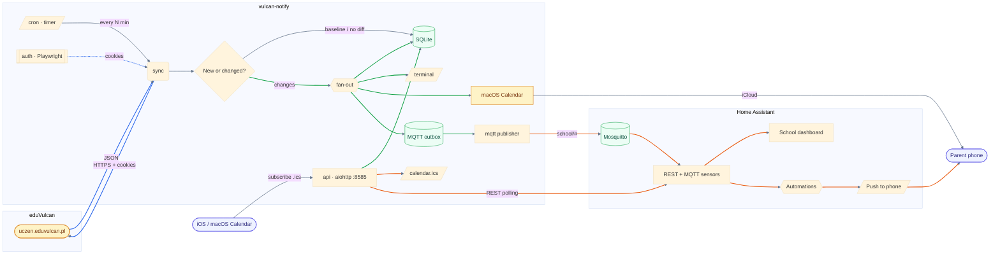

# vulcan-notify

> [!TIP]
> ✨ ***Push notifications, calendars, and dashboards from a school e-journal that refuses to give them to you.***

CLI tool that syncs data from the eduVulcan school e-journal to a local SQLite database, detects changes between runs, and fans them out to a terminal, macOS Calendar, an MQTT broker, and an HTTP/iCalendar API.

Solves the problem of eduVulcan paywalling push notifications behind a subscription, while the web version (which is legally required to remain free) has no notification support. Also exposes a local HTTP + MQTT surface so Home Assistant (or anything else) can react to school events in real time.

> [!NOTE]
> [📦 Installation](#installation) · [⚡ Commands](#commands) · [⚙️ How it works](#how-it-works) · [🏠 Home Assistant integration](#home-assistant-integration) · [🔐 Auto-login](#auto-login) · [📅 Calendar integration](#calendar-integration) · [🔧 Configuration](#configuration) · [📚 Documentation](#documentation)

## What it tracks

- **Grades** - new and changed, with subject, teacher, category, and weight
- **Attendance** - absences and late arrivals
- **Exams** - upcoming tests and quizzes, with description and teacher
- **Homework** - upcoming assignments, with full description
- **Messages** - unread count and body, with optional sender whitelist filtering
- **Lesson schedule** - substitutions, cancellations, and extra lessons

Supports multiple students under one parent account.

## What it exposes

- **Terminal output** - colored when interactive, plain when piped
- **macOS Calendar** - exams and homework as all-day events with reminders (iCloud syncs to iOS)
- **MQTT events** - every detected change published to Mosquitto (with a persistent outbox for retries)
- **HTTP API** - grade aggregates, homework, messages, and schedule over aiohttp on port 8585
- **iCalendar feed** - per-student `.ics` feed for subscribing from iOS/macOS Calendar, Google Calendar, or Home Assistant
- **AI summaries** - optional digest of recent changes or messages via any OpenAI-compatible API

## 📦 Installation <a name="installation"></a>

**Requirements:** Python 3.12+, [uv](https://docs.astral.sh/uv/) package manager

```bash
git clone https://github.com/yourname/vulcan-notify.git
cd vulcan-notify
uv sync

# Install Playwright browsers (needed for auth)
uv run playwright install chromium

# Configure (optional)
cp .env.example .env
# Edit .env to set MESSAGE_SENDER_WHITELIST, MQTT_*, CALENDAR_MAP, etc.

# Authenticate with eduVulcan (opens browser)
uv run vulcan-notify auth

# Test session validity
uv run vulcan-notify test

# Sync data and see changes
uv run vulcan-notify sync
```

## ⚡ Commands <a name="commands"></a>

| Command | Description |
|---------|-------------|
| `vulcan-notify auth` | Interactive browser login, saves session cookies |
| `vulcan-notify test` | Test if saved session is still valid |
| `vulcan-notify sync` | Fetch latest data and show changes (default) |
| `vulcan-notify calendar` | Force re-sync all exams/homework to macOS Calendar |
| `vulcan-notify tui` | Interactive Textual browser for synced content (requires `uv sync --extra tui`) |
| `vulcan-notify summarize [--type sync\|messages] [--days N]` | AI summary of recent changes or messages (requires `LLM_API_KEY`) |

## ⚙️ How it works <a name="how-it-works"></a>

End-to-end flow from the eduVulcan API down to a push notification on your phone and a tile on your Home Assistant dashboard:



1. **Auth** - Playwright opens a browser for you to log into eduvulcan.pl. After login, session cookies are saved locally. If login credentials are provided, expired sessions are renewed headlessly on subsequent runs.
2. **Fetch** - The tool calls the eduVulcan web API directly (using saved cookies) to pull grades (all periods), attendance (last 90 days), exams, homework with full body, messages, and the lesson schedule including substitutions.
3. **Diff** - Each item is compared against the local SQLite database. New or changed items are reported; exams and homework that disappear from the API are soft-deleted.
4. **Persist** - All upserts are idempotent (`INSERT OR REPLACE`). Each run is recorded in a `sync_runs` table.
5. **Publish** - Changes fan out in parallel: printed to the terminal, written to macOS Calendar (if configured), enqueued in the MQTT outbox and drained to Mosquitto (if configured). The outbox survives broker outages.
6. **Serve** (separate command, long-running) - `vulcan-notify api` (via Docker or systemd service) exposes the HTTP + iCalendar endpoints backed by the same SQLite file.

On first sync, all existing data is stored without reporting changes (baseline). Only subsequent syncs show what's new.

For the full module breakdown, database schema, MQTT topic map, and HTTP endpoint reference, see [`docs/architecture.md`](docs/architecture.md).

## 🏠 Home Assistant integration <a name="home-assistant-integration"></a>

Production setup runs vulcan-notify as a Docker container on a Proxmox LXC, publishing MQTT events to the Mosquitto broker inside Home Assistant OS. Two ways to wire it up:

- **Event-driven (MQTT)** - subscribe to `school/#` and build sensors or automations. Topic scheme: `<prefix>/<student-slug>/<segment>/<change_type>`, e.g. `school/alice/grades/new`, `school/alice/exams/updated`, `school/alice/attendance/alert`, `school/alice/substitutions/new`. Payloads are structured JSON with the full change metadata.
- **Pull-based (HTTP)** - HA's REST sensor polls `/api/grades/monthly`, `/api/messages`, `/api/schedule`, etc. for dashboards and history graphs. The iCalendar feed at `/calendar/<name>.ics` can be subscribed directly from any calendar client.

See [`docs/architecture.md`](docs/architecture.md) for the full endpoint list, MQTT topic map, and payload examples. See [`docs/deployment.md`](docs/deployment.md) for the Proxmox/Docker/systemd setup.

## 🔐 Auto-login <a name="auto-login"></a>

eduVulcan sessions expire after a few hours. To run fully unattended (e.g., on a home server with a cron job), store your credentials so the script re-authenticates automatically when a session expires.

**Option 1: macOS Keychain** (recommended, no plaintext on disk)

```bash
security add-generic-password -s vulcan-notify -a your.email@example.com -w
# Prompts for password interactively
```

**Option 2: environment variables** - add to `.env`:

```
VULCAN_LOGIN=your.email@example.com
VULCAN_PASSWORD=your_password
```

When credentials are available, `vulcan-notify sync` detects expired sessions and re-authenticates headlessly via Playwright - no manual browser interaction needed.

## 📅 Calendar integration <a name="calendar-integration"></a>

Push exams and homework to iCloud Calendar as all-day events with reminder alarms. Events sync to all devices via iCloud.

Add to `.env`:

```
CALENDAR_MAP={"Alice Smith": "School Alice", "Bob Johnson": "School Bob"}
```

The calendar names must match existing calendars in macOS Calendar. Each student maps to their own calendar.

When configured, `vulcan-notify sync` automatically creates and updates calendar events. Use `vulcan-notify calendar` to force a clean re-sync of all events. Events are deduplicated by storing the macOS calendar UID in the database; when exams or homework are removed from the API (soft-deleted), their calendar events are also removed.

## 🔧 Configuration <a name="configuration"></a>

All settings are via environment variables or `.env` file:

| Variable | Default | Description |
|----------|---------|-------------|
| `DB_PATH` | `vulcan_notify.db` | SQLite database path |
| `SESSION_FILE` | `session.json` | Saved session cookies path |
| `VULCAN_LOGIN` | (none) | eduVulcan login email for auto-login |
| `VULCAN_PASSWORD` | (none) | eduVulcan password for auto-login |
| `SYNC_ATTENDANCE_DAYS` | `90` | How many days back to sync attendance |
| `SYNC_MESSAGE_BACKFILL_BATCH` | `10` | Legacy messages to refetch bodies for, per run |
| `POLL_INTERVAL` | `1800` | Seconds between polls when run as a service |
| `QUIET_HOURS_START` | `0` | Hour (0-23) to start quiet window, sync paused |
| `QUIET_HOURS_END` | `5` | Hour (0-23) to end quiet window, sync resumes |
| `MESSAGE_SENDER_WHITELIST` | (empty) | Comma-separated sender names to filter messages |
| `CALENDAR_MAP` | (empty) | JSON dict mapping student names to macOS calendar names |
| `CALENDAR_REMINDER_HOURS` | `24` | Hours before event for calendar alarm |
| `MQTT_ENABLED` | `false` | Enable MQTT publishing |
| `MQTT_BROKER` | `localhost` | Mosquitto hostname |
| `MQTT_PORT` | `1883` | Mosquitto port |
| `MQTT_USERNAME` | (none) | Optional MQTT auth |
| `MQTT_PASSWORD` | (none) | Optional MQTT auth |
| `MQTT_TOPIC_PREFIX` | `school` | Topic namespace root |
| `NTFY_TOPIC` | `vulcan-notify` | ntfy.sh topic (if used) |
| `NTFY_SERVER` | `https://ntfy.sh` | ntfy server base URL |
| `LLM_BASE_URL` | `https://api.cerebras.ai/v1` | OpenAI-compatible API base URL for AI summaries |
| `LLM_API_KEY` | (none) | API key for AI summaries (disabled if unset) |
| `LLM_MODEL` | `qwen-3-235b-a22b-instruct-2507` | Model name for AI summaries |
| `LOG_LEVEL` | `INFO` | Logging level |

## 📚 Documentation <a name="documentation"></a>

- [`docs/architecture.md`](docs/architecture.md) - internal architecture, pipeline, database schema, MQTT payloads, endpoint reference
- [`docs/deployment.md`](docs/deployment.md) - Docker + Proxmox LXC + systemd setup
- [`docs/eduvulcan-api.md`](docs/eduvulcan-api.md) - reverse-engineered eduVulcan web API reference
