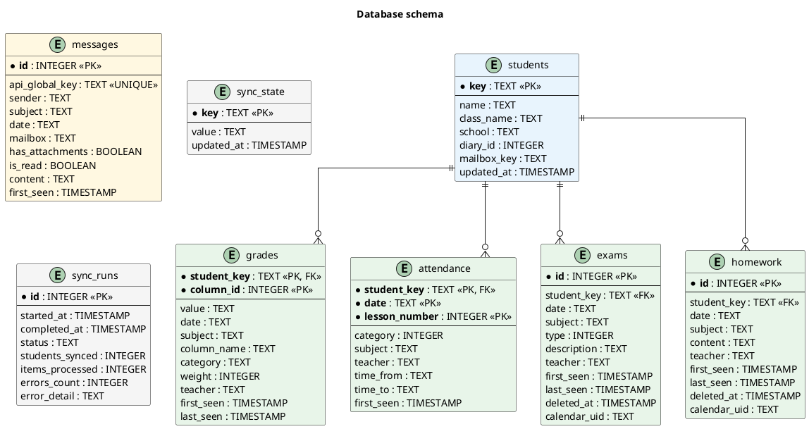

# vulcan-notify

CLI tool that syncs data from the eduVulcan school e-journal to a local SQLite database and shows what changed since the last sync.

Solves the problem of eduVulcan paywalling push notifications behind a subscription, while the web version (which is legally required to remain free) has no notification support.

## What it tracks

- **Grades** - new and changed, with subject, teacher, and category
- **Attendance** - absences, late arrivals
- **Exams** - upcoming tests and quizzes, with description and teacher
- **Homework** - upcoming assignments, with full description and teacher
- **Messages** - unread count, with optional sender whitelist filtering
- **iCloud Calendar** - pushes exams and homework to macOS Calendar (optional)

Supports multiple students under one parent account.

## Prerequisites

- Python 3.12+
- [uv](https://docs.astral.sh/uv/) package manager

## Setup

```bash
# Clone and install
git clone https://github.com/yourname/vulcan-notify.git
cd vulcan-notify
uv sync

# Install Playwright browsers (needed for auth)
uv run playwright install chromium

# Configure (optional)
cp .env.example .env
# Edit .env to set MESSAGE_SENDER_WHITELIST if desired

# Authenticate with eduVulcan (opens browser)
uv run vulcan-notify auth

# Test session validity
uv run vulcan-notify test

# Sync data and see changes
uv run vulcan-notify sync
```

## Commands

| Command | Description |
|---------|-------------|
| `vulcan-notify auth` | Interactive browser login, saves session cookies |
| `vulcan-notify test` | Test if saved session is still valid |
| `vulcan-notify sync` | Fetch latest data and show changes (default) |
| `vulcan-notify calendar` | Force re-sync all exams/homework to macOS Calendar |
| `vulcan-notify summarize` | AI summary of stored messages (requires `LLM_API_KEY`) |

## How it works

1. **Auth**: Playwright opens a browser for you to log into eduvulcan.pl. After login, session cookies are saved locally.

2. **Sync**: The tool calls the eduVulcan web API directly (using saved cookies) to fetch grades (all periods), attendance (last 90 days), exams, homework (with full descriptions), and messages for all students. Each sync run is tracked in the database.

3. **Diff**: Each item is compared against the local SQLite database. New or changed items are reported. Exams and homework that disappear from the API are soft-deleted.

4. **Calendar**: If configured, new and updated exams/homework are pushed to macOS Calendar as all-day events with reminder alarms.

5. **Display**: Changes are printed to the terminal, grouped by student and data type. Optionally, an AI-generated summary is appended.

On first sync, all existing data is stored without reporting changes (baseline). Only subsequent syncs show what's new.

## Auto-login (headless)

eduVulcan sessions expire after a few hours. To run fully unattended (e.g., on a home server with a cron job), you can store your credentials so the script re-authenticates automatically when a session expires.

**Option 1: macOS Keychain** (recommended, no plaintext on disk)

```bash
security add-generic-password -s vulcan-notify -a your.email@example.com -w
# Prompts for password interactively
```

**Option 2: environment variables**

Add to `.env`:

```
VULCAN_LOGIN=your.email@example.com
VULCAN_PASSWORD=your_password
```

When credentials are available, `vulcan-notify sync` detects expired sessions and re-authenticates headlessly via Playwright - no manual browser interaction needed.

## Calendar integration (macOS)

Push exams and homework to iCloud Calendar as all-day events with reminder alarms. Events sync to all devices via iCloud.

Add to `.env`:

```
CALENDAR_MAP={"Yarema Senyuk": "School Yarema", "Solomiia Senyuk": "School Solya"}
```

The calendar names must match existing calendars in macOS Calendar. Each student maps to their own calendar.

When configured, `vulcan-notify sync` automatically creates and updates calendar events. Use `vulcan-notify calendar` to force a clean re-sync of all events.

Events are deduplicated by storing the macOS calendar UID in the database. When exams or homework are removed from the API (soft-deleted), their calendar events are also removed.

## Database schema




## Configuration

All settings are via environment variables or `.env` file:

| Variable | Default | Description |
|----------|---------|-------------|
| `DB_PATH` | `vulcan_notify.db` | SQLite database path |
| `SESSION_FILE` | `session.json` | Saved session cookies path |
| `VULCAN_LOGIN` | (none) | eduVulcan login email for auto-login |
| `VULCAN_PASSWORD` | (none) | eduVulcan password for auto-login |
| `SYNC_ATTENDANCE_DAYS` | `90` | How many days back to sync attendance |
| `MESSAGE_SENDER_WHITELIST` | (empty) | Comma-separated sender names to filter messages |
| `CALENDAR_MAP` | (empty) | JSON dict mapping student names to macOS calendar names |
| `CALENDAR_REMINDER_HOURS` | `24` | Hours before event for calendar alarm |
| `LLM_BASE_URL` | `https://api.cerebras.ai/v1` | OpenAI-compatible API base URL for AI summaries |
| `LLM_API_KEY` | (none) | API key for AI summaries (disabled if unset) |
| `LLM_MODEL` | `qwen-3-235b-a22b-instruct-2507` | Model name for AI summaries |
| `LOG_LEVEL` | `INFO` | Logging level |
