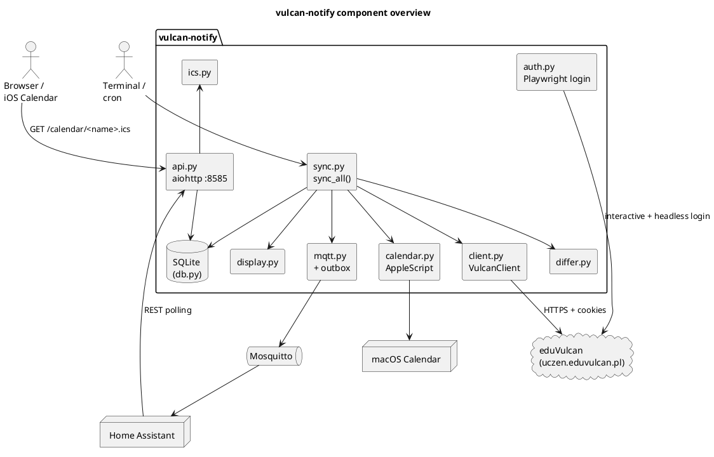
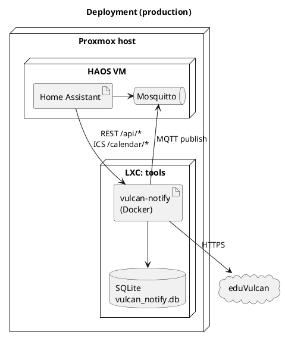

# Architecture

This document explains how `vulcan-notify` is put together: the sync pipeline, persistence, change detection, and the fan-out to notification channels (terminal, macOS Calendar, MQTT, HTTP/iCalendar).

For deployment topology (Docker + Proxmox LXC + systemd), see [`deployment.md`](deployment.md). For the reverse-engineered upstream API, see [`eduvulcan-api.md`](eduvulcan-api.md).

## Overview

`vulcan-notify` is a Python async CLI. Each run authenticates against eduVulcan's web session, pulls all tracked data for every student on the account, diffs it against a local SQLite baseline, persists the new state, and fans out the detected changes to one or more notification channels.




## Pipeline

The CLI always follows the same six-phase pipeline:

| Phase | Module | Entry point | Role |
|-------|--------|-------------|------|
| Auth | `auth.py` | `get_session()` | Load cookies; open Playwright for interactive login on first run or after expiry. Fall back to headless re-auth if credentials are available. |
| Fetch | `client.py` | `VulcanClient` methods | Pull students, grades (all periods), attendance (last N days), exams, homework (full body), messages, lesson schedule with substitutions. |
| Diff | `differ.py` | `diff_*` | Produce `Change` objects by comparing fetched data to the DB. |
| Persist | `db.py` | `Database.upsert_*` | Apply `INSERT OR REPLACE` upserts; soft-delete removed exams/homework. |
| Publish | `display.py`, `calendar.py`, `mqtt.py` | Fan-out | Print to terminal, sync macOS Calendar events, enqueue + publish MQTT messages. |
| Serve | `api.py` (separate process/command) | aiohttp app | Expose HTTP endpoints and iCalendar feeds over the same SQLite. |

On first sync for a student, every item is treated as baseline: stored silently, no change events emitted. Only subsequent runs report diffs.

## Modules

| File | Responsibility | Key symbols |
|------|----------------|-------------|
| `__main__.py` | CLI entry. Dispatches subcommands: `auth`, `test`, `sync`, `calendar`, `tui`, `summarize`. | `main()` |
| `config.py` | `pydantic-settings` singleton loaded from `.env` + env vars. | `Settings`, `settings` |
| `auth.py` | Playwright browser + headless login; cookie jar persistence; macOS Keychain fallback. | `get_session()`, `cookies_for_url()` |
| `client.py` | aiohttp wrapper over the eduVulcan web API. Detects HTML responses as expired-session sentinel. | `VulcanClient` |
| `models.py` | Dataclasses for API responses: `Student`, `Grade`, `AttendanceEntry`, `Exam`, `Homework`, `Message`, `Lesson`. | — |
| `sync.py` | Orchestrates one full sync run per student; writes a `sync_runs` row; fans out to channels. | `sync_all()`, `SyncResult` |
| `differ.py` | Detects new/updated/deleted items. Returns `Change` dataclasses. | `diff_grades`, `diff_attendance`, `diff_exams`, `diff_homework`, `diff_messages`, `diff_schedule` |
| `db.py` | Async SQLite persistence via aiosqlite. All writes are `INSERT OR REPLACE`. | `Database` |
| `display.py` | Terminal output with ANSI colors (auto-disabled when piped). | `format_result()` |
| `calendar.py` | macOS Calendar integration via AppleScript. Dedup by stored UID; soft-deleted items remove events. | `sync_calendar()` |
| `mqtt.py` | Maps `Change` → topic + JSON payload; writes to the `mqtt_outbox` table; drains outbox to Mosquitto on every sync. | `topic_for()`, `build_payload()`, `flush_outbox()` |
| `api.py` | aiohttp HTTP server (port 8585). Grade aggregates, homework/messages/schedule endpoints, iCalendar feed. | `build_app()` |
| `ics.py` | Zero-dependency RFC 5545 iCalendar writer. | `build_calendar()` |
| `summarizer.py` | Optional AI digest via OpenAI-compatible APIs (profiles: `sync`, `messages`). | `summarize()` |
| `tui.py` | Optional Textual TUI for browsing synced content (extra `tui` install). | `VulcanApp` |

## Data model

SQLite lives at `DB_PATH` (default `vulcan_notify.db`). Tables:

| Table | Primary key | Notes |
|-------|-------------|-------|
| `students` | `key` | One row per student on the account. |
| `grades` | `(student_key, column_id)` | `column_id` is the upstream grade-column id; `last_seen` tracks re-appearance. |
| `attendance` | `(student_key, date, lesson_number)` | Append-only in practice. |
| `exams`, `homework` | `id` | `deleted_at` for soft-delete; `calendar_uid` for macOS Calendar dedup. |
| `messages` | `id` with `UNIQUE(api_global_key)` | `content` is backfilled in batches of `SYNC_MESSAGE_BACKFILL_BATCH` per run for legacy rows. |
| `schedule` | `(student_key, date, time_from, subject)` | Per-lesson schedule including substitutions (`sub_teacher`, `sub_room`), cancellations (`annotation`), and extra lessons (`is_extra`). |
| `mqtt_outbox` | `id` AUTOINCREMENT | Every MQTT publish is enqueued first; drained on each run. Broker outages survive restarts. |
| `sync_state` | `key` | Generic KV for per-run state (e.g., cursors, first-sync flags). |
| `sync_runs` | `id` AUTOINCREMENT | History of runs with status, counts, and error detail. |

The full entity diagram (students + primary entities) is in the [README](../README.md#database-schema).

## Change detection

`differ.py` compares the freshly fetched API list against the stored rows. The keying strategy per entity:

- **Grades** — keyed by `column_id`. Value or category change → `updated`.
- **Attendance** — keyed by `(date, lesson_number)`. New row → alert (no "updated" path).
- **Exams / homework** — keyed by upstream `id`. Disappearance → soft-delete (`deleted_at` set, calendar event removed).
- **Messages** — keyed by `api_global_key`. Content is pulled lazily; the MQTT payload for a newly-appeared message includes the body once fetched.
- **Schedule** — keyed by `(date, time_from, subject)`. Three independent change types are emitted: `substitution` (teacher/room swap), `cancellation` (annotation flag set), `addition` (is_extra lesson inserted).

First sync for a student writes a `sync_state` marker and suppresses all changes, so new installs don't flood channels with backlog noise.

## Notification channels

### Terminal (`display.py`)

Primary, always on. Groups output by student, then data type. ANSI colors are auto-disabled when stdout is not a TTY, so piping to a log file stays clean. This is the shape meant for cron (`vulcan-notify sync >> sync.log`).

### macOS Calendar (`calendar.py`)

Optional. Driven by `CALENDAR_MAP` (JSON dict: student name → macOS calendar name). For each new/updated exam and homework, AppleScript creates an all-day event with a reminder alarm (`CALENDAR_REMINDER_HOURS`). The macOS-assigned UID is stored back in the DB so subsequent syncs update in-place and soft-deletes remove the event. iCloud handles propagation to iPhone/iPad.

### MQTT (`mqtt.py` + `mqtt_outbox`)

Optional (`MQTT_ENABLED=true`). Every `Change` is enqueued in `mqtt_outbox` inside the same transaction that persists the entity. A separate drain step publishes to Mosquitto; failures stay in the outbox and are retried on the next run. This gives at-least-once delivery without requiring the broker to be up at sync time.

**Topic scheme:** `<MQTT_TOPIC_PREFIX>/<student-slug>/<segment>/<change_type>`

- `<segment>` maps item types to plural names: `grades`, `exams`, `homework`, `substitutions`, `cancellations`, `additions`, `messages`.
- `<change_type>` is `new`, `updated`, or `alert` (attendance is always `alert`).
- Message topics use the mailbox slug instead of student slug (`<prefix>/<mailbox>/messages/new`).

**Example payload** (new grade):

```json
{
  "student": "Alice Smith",
  "title": "New grade: Math",
  "message": "5 (Sprawdzian, weight 3)",
  "timestamp": "2026-04-14T09:12:03+00:00",
  "subject": "Math",
  "value": "5",
  "category": "Sprawdzian",
  "weight": 3,
  "teacher": "Kowalska A.",
  "date": "2026-04-12"
}
```

Subscribe in Home Assistant with MQTT sensors / automations on `school/#`.

### HTTP API (`api.py`)

Optional, long-running. Starts an aiohttp server on port 8585 that reads from the same SQLite. Not started by `sync` — run it as a separate process (e.g., a second container or systemd service). Endpoints:

| Route | Purpose |
|-------|---------|
| `GET /api/health` | Liveness probe. |
| `GET /api/grades?student=&days=` | Weighted rolling average. |
| `GET /api/grades/average` | Aggregate current-period average. |
| `GET /api/grades/monthly?year=&months=` | Per-month averages. |
| `GET /api/grades/by-subject?student=` | Per-subject averages. |
| `GET /api/homework?n=` | Recent homework. |
| `GET /api/messages?n=` | Recent messages (with content once backfilled). |
| `GET /api/schedule?student=&date_from=&date_to=` | Lesson schedule including substitutions/cancellations. |
| `GET /calendar/<student>.ics` | Per-student iCalendar feed (see below). |

All responses are JSON except the ICS feed.

### iCalendar feed (`ics.py`)

`GET /calendar/<student>.ics` returns an RFC 5545 feed of the student's lesson schedule. Zero external deps — hand-rolled so it builds in any minimal container. Point a calendar client (iOS, macOS Calendar subscribe, Google Calendar "from URL", Thunderbird) at the URL for a self-updating timetable that reflects substitutions and cancellations.

### ntfy (optional)

`NTFY_TOPIC` / `NTFY_SERVER` can be configured to push notifications via ntfy.sh. Useful when you want phone push without Home Assistant.

## Auth & session management

1. `vulcan-notify auth` opens a real Chromium window via Playwright. After the user logs in, cookies are serialized to `SESSION_FILE` (`session.json`).
2. Every subsequent run loads the cookie jar and hits the API directly — no browser needed.
3. If the client detects an HTML response (eduVulcan's expired-session sentinel) and credentials are available (from `.env` or the macOS Keychain service `vulcan-notify`), it runs headless Playwright to re-auth, then retries. Fully unattended on a home server.
4. SSL uses certifi's bundled root store so it works inside minimal containers.

## Home Assistant integration

Two ingress paths:

- **Event-driven (MQTT)** — most reactive. HA subscribes to `school/#`, creates sensors per student, and runs automations when the right topic fires. Backed by the persistent outbox, so an HA restart or broker hiccup doesn't lose events.
- **Pull-based (HTTP)** — for dashboards. HA's REST sensor polls the `/api/grades/monthly`, `/api/messages`, etc. endpoints for numeric state and history graphs.

The iCalendar feed is orthogonal — it's meant to be consumed directly by calendar apps (including HA's calendar integration if desired).

## Deployment topology

Production runs on a Proxmox LXC (Ubuntu 24.04) as a Docker container with headless Chromium for auto-reauth. Two systemd timers on the host handle CI/CD (poll GitHub, rebuild on new commits) and daily backups of the SQLite file. The MQTT broker runs inside the Home Assistant OS VM on the same Proxmox node. Full details: [`deployment.md`](deployment.md).




## Extension points

- **New source platform.** Swap `client.py` + `auth.py` for an alternative backend. Keep the `models.py` dataclasses and the `differ.py` contracts; the rest of the pipeline is platform-agnostic.
- **New notification channel.** Add a module that consumes `list[Change]` from `sync_all()` and wire it in. Follow the `mqtt.py` pattern (idempotent, failure-tolerant) rather than `calendar.py` (side-effects on external state) for anything network-bound.
- **New HTTP endpoint.** Register under `build_app()` in `api.py`. Read from `Database` directly; do not fetch from eduVulcan in request handlers.

## Testing

- `pytest-asyncio` with `asyncio_mode = "auto"` (no decorators needed).
- `tests/conftest.py` provides a `db` fixture backed by a temp SQLite.
- `VulcanClient` is mocked with `AsyncMock` in sync tests.
- aiohttp is mocked via the `_mock_response` helper in `tests/test_client.py`.

Run everything: `uv run pytest`. Single file: `uv run pytest tests/test_sync.py -x -q`.
