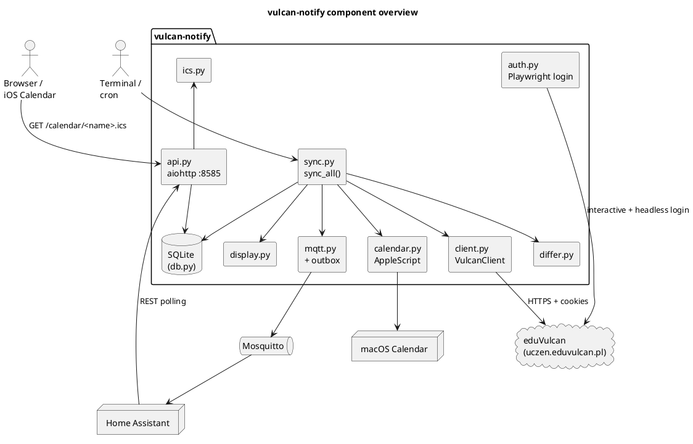
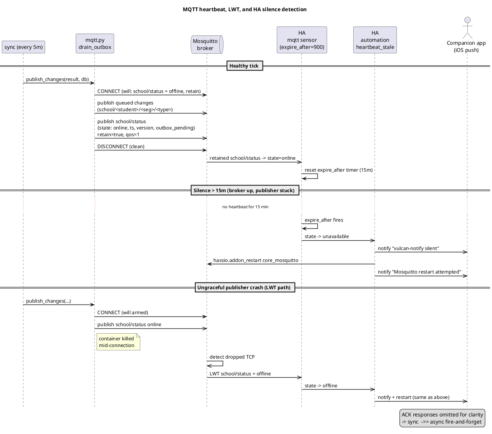
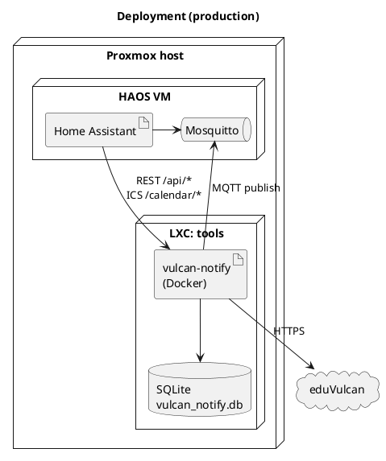

# Architecture

This document explains how `vulcan-notify` is put together: the sync pipeline, persistence, change detection, and the fan-out to notification channels (terminal, macOS Calendar, MQTT, HTTP/iCalendar).

For deployment topology (Docker + Proxmox LXC + systemd), see [`deployment.md`](deployment.md). For the reverse-engineered upstream API, see [`eduvulcan-api.md`](eduvulcan-api.md).

## Overview

`vulcan-notify` is a Python async CLI. Each run authenticates against eduVulcan's web session, pulls all tracked data for every student on the account, diffs it against a local SQLite baseline, persists the new state, and fans out the detected changes to one or more notification channels.


```plantuml
@startuml
title vulcan-notify component overview

skinparam componentStyle rectangle

cloud "eduVulcan\n(uczen.eduvulcan.pl)" as vulcan

package "vulcan-notify" {
  [auth.py\nPlaywright login] as auth
  [client.py\nVulcanClient] as client
  [sync.py\nsync_all()] as sync
  [differ.py] as differ
  database "SQLite\n(db.py)" as db
  [display.py] as display
  [calendar.py\nAppleScript] as cal
  [mqtt.py\n+ outbox] as mqtt
  [api.py\naiohttp :8585] as api
  [ics.py] as ics
}

node "macOS Calendar" as macal
queue "Mosquitto" as broker
node "Home Assistant" as ha
actor "Browser /\niOS Calendar" as browser
actor "Terminal /\ncron" as cron

auth --> vulcan : interactive + headless login
client --> vulcan : HTTPS + cookies
sync --> client
sync --> differ
sync --> db
sync --> display
sync --> cal
sync --> mqtt
cal --> macal
mqtt --> broker
broker --> ha
api --> db
ics <-- api
browser --> api : GET /calendar/<name>.ics
ha --> api : REST polling
cron --> sync
@enduml
```


## Pipeline

The CLI always follows the same six-phase pipeline:

| Phase | Module | Entry point | Role |
|-------|--------|-------------|------|
| Auth | `auth.py` | `get_session()` | Load cookies; open Playwright for interactive login on first run or after expiry. Fall back to headless re-auth if credentials are available. |
| Fetch | `client.py` | `VulcanClient` methods | Pull students, grades (all periods), attendance (last N days), exams, homework (full body), messages, lesson schedule with substitutions. |
| Diff | `differ.py` | `diff_*` | Produce `Change` objects by comparing fetched data to the DB. |
| Persist | `db.py` | `Database.upsert_*` | Apply `ON CONFLICT ... DO UPDATE` upserts; soft-delete removed exams/homework. |
| Publish | `display.py`, `calendar.py`, `mqtt.py` | Fan-out | Print to terminal, sync macOS Calendar events, enqueue + publish MQTT messages. |
| Serve | `api.py` (separate process/command) | aiohttp app | Expose HTTP endpoints and iCalendar feeds over the same SQLite. |

On first sync for a student, every item is treated as baseline: stored silently, no change events emitted. Only subsequent runs report diffs.

## Modules

| File | Responsibility | Key symbols |
|------|----------------|-------------|
| `__main__.py` | CLI entry. Dispatches subcommands: `auth`, `test`, `sync`, `calendar`, `tui`, `summarize`. | `main()` |
| `config.py` | `pydantic-settings` singleton loaded from `.env` + env vars. | `Settings`, `settings` |
| `auth.py` | Playwright browser + headless login; cookie jar persistence; macOS Keychain fallback. | `get_session()`, `cookies_for_url()` |
| `client.py` | aiohttp wrapper over the eduVulcan web API. Detects HTML responses as expired-session sentinel. | `VulcanClient` |
| `models.py` | Dataclasses for API responses: `Student`, `Grade`, `AttendanceEntry`, `Exam`, `Homework`, `Message`, `Lesson`. | — |
| `sync.py` | Orchestrates one full sync run per student; writes a `sync_runs` row; fans out to channels. | `sync_all()`, `SyncResult` |
| `differ.py` | Detects new/updated/deleted items. Returns `Change` dataclasses. | `diff_grades`, `diff_attendance`, `diff_exams`, `diff_homework`, `diff_messages`, `diff_schedule` |
| `db.py` | Async SQLite persistence via aiosqlite. All writes are `ON CONFLICT ... DO UPDATE`. | `Database` |
| `display.py` | Terminal output with ANSI colors (auto-disabled when piped). | `format_result()` |
| `calendar.py` | macOS Calendar integration via AppleScript. Dedup by stored UID; soft-deleted items remove events. | `sync_calendar()` |
| `mqtt.py` | Maps `Change` → topic + JSON payload; writes to the `mqtt_outbox` table; drains outbox to Mosquitto on every sync and publishes a retained heartbeat + LWT on `<prefix>/status`. | `topic_for()`, `build_payload()`, `build_status_payload()`, `drain_outbox()` |
| `api.py` | aiohttp HTTP server (port 8585). Grade aggregates, homework/messages/schedule endpoints, iCalendar feed. | `build_app()` |
| `ics.py` | Zero-dependency RFC 5545 iCalendar writer. | `build_calendar()` |
| `summarizer.py` | Optional AI digest via OpenAI-compatible APIs (profiles: `sync`, `messages`). | `summarize()` |
| `tui.py` | Optional Textual TUI for browsing synced content (extra `tui` install). | `VulcanApp` |

## Data model

SQLite lives at `DB_PATH` (default `vulcan_notify.db`). Tables:

| Table | Primary key | Notes |
|-------|-------------|-------|
| `students` | `key` | One row per student on the account. |
| `grades` | `(student_key, column_id)` | `column_id` is the upstream grade-column id; `last_seen` tracks re-appearance. |
| `attendance` | `(student_key, date, lesson_number)` | Append-only in practice. |
| `exams`, `homework` | `id` | `deleted_at` for soft-delete; `calendar_uid` for macOS Calendar dedup. |
| `messages` | `id` with `UNIQUE(api_global_key)` | `content` is backfilled in batches of `SYNC_MESSAGE_BACKFILL_BATCH` per run for legacy rows. |
| `schedule` | `(student_key, date, time_from, subject)` | Per-lesson schedule including substitutions (`sub_teacher`, `sub_room`), cancellations (`annotation`), and extra lessons (`is_extra`). |
| `mqtt_outbox` | `id` AUTOINCREMENT | Every MQTT publish is enqueued first; drained on each run. Broker outages survive restarts. |
| `sync_state` | `key` | Generic KV. Holds `last_sync:<student>` (has this student ever synced — drives first-sync suppression) and `last_success:<student>:<section>` (freshness, written only after a confirmed fetch). The two are deliberately separate. |
| `sync_runs` | `id` AUTOINCREMENT | History of runs: `completed`, `degraded` (a section failed), `failed`, or `interrupted` (abandoned mid-run, reconciled on the next start). Pruned past `SYNC_HISTORY_KEEP_DAYS`. |
| `sync_sections` | `id` AUTOINCREMENT | Per-section, per-student outcome for each run, with item counts and error detail. Without it a partial outage — grades broken, everything else fine — is invisible. |

The full entity diagram (students + primary entities) is in the [README](../README.md#database-schema).

## Change detection

`differ.py` compares the freshly fetched API list against the stored rows. The keying strategy per entity:

- **Grades** — keyed by `column_id`. Value or category change → `updated`.
- **Attendance** — keyed by `(date, lesson_number)`. New row → alert (no "updated" path).
- **Exams / homework** — keyed by upstream `id`. Disappearance → soft-delete (`deleted_at` set, calendar event removed).
- **Messages** — keyed by `api_global_key`. Content is pulled lazily; the MQTT payload for a newly-appeared message includes the body once fetched.
- **Schedule** — keyed by `(date, time_from, subject)`. Three independent change types are emitted: `substitution` (teacher/room swap), `cancellation` (annotation flag set), `addition` (is_extra lesson inserted).

First sync for a student writes a `sync_state` marker and suppresses all changes, so new installs don't flood channels with backlog noise.

## Notification channels

### Terminal (`display.py`)

Primary, always on. Groups output by student, then data type. ANSI colors are auto-disabled when stdout is not a TTY, so piping to a log file stays clean. This is the shape meant for cron (`vulcan-notify sync >> sync.log`).

### macOS Calendar (`calendar.py`)

Optional. Driven by `CALENDAR_MAP` (JSON dict: student name → macOS calendar name). For each new/updated exam and homework, AppleScript creates an all-day event with a reminder alarm (`CALENDAR_REMINDER_HOURS`). The macOS-assigned UID is stored back in the DB so subsequent syncs update in-place and soft-deletes remove the event. iCloud handles propagation to iPhone/iPad.

### MQTT (`mqtt.py` + `mqtt_outbox`)

Optional (`MQTT_ENABLED=true`). Every `Change` is enqueued in `mqtt_outbox` inside the same transaction that persists the entity. A separate drain step publishes to Mosquitto; failures stay in the outbox and are retried on the next run. This gives at-least-once delivery without requiring the broker to be up at sync time.

**Topic scheme:** `<MQTT_TOPIC_PREFIX>/<student-slug>/<segment>/<change_type>`

- `<segment>` maps item types to plural names: `grades`, `exams`, `homework`, `substitutions`, `cancellations`, `additions`, `messages`.
- `<change_type>` is `new`, `updated`, or `alert` (attendance is always `alert`).
- Message topics use the mailbox slug instead of student slug (`<prefix>/<mailbox>/messages/new`).

**Example payload** (new grade):

```json
{
  "student": "Alice Smith",
  "title": "New grade: Math",
  "message": "5 (Sprawdzian, weight 3)",
  "timestamp": "2026-04-14T09:12:03+00:00",
  "subject": "Math",
  "value": "5",
  "category": "Sprawdzian",
  "weight": 3,
  "teacher": "Kowalska A.",
  "date": "2026-04-12"
}
```

Subscribe in Home Assistant with MQTT sensors / automations on `school/#`.

#### Heartbeat, LWT, and outage detection

Every sync tick publishes a retained heartbeat to `<MQTT_TOPIC_PREFIX>/status` (default `school/status`), even when there are zero changes, so the absence of messages is itself a signal. The aiomqtt client also registers a Last-Will-Testament on the same topic; if the publisher disconnects ungracefully (crash, OOM, network drop mid-connection), the broker auto-publishes `{state: "offline"}` with `retain=true`.

**Heartbeat payload:**

```json
{
  "state": "online",
  "ts": "2026-04-14T16:13:22.457+00:00",
  "outbox_pending": 0,
  "version": "0.11.0"
}
```

Home Assistant subscribes with an MQTT sensor whose `expire_after: 900` flips the state to `unavailable` if no heartbeat arrives for 15 min (3x the 5-min sync cadence). A companion automation triggers on `unavailable` or `offline`, sends a push via the mobile app, and calls `hassio.addon_restart` on `core_mosquitto`. The LWT path catches mid-connection crashes; `expire_after` catches the more common case where the publisher's short-lived connection disconnects cleanly but then fails to reconnect on the next tick (broker hung, network partition, bad credentials).


```plantuml
@startuml
title MQTT heartbeat, LWT, and HA silence detection
skinparam sequenceArrowThickness 1.5
skinparam LifeLineBorderColor #C0C0C0
hide footbox

participant "sync (every 5m)" as sync
participant "mqtt.py\ndrain_outbox" as mqtt
queue "Mosquitto\nbroker" as broker
participant "HA\nmqtt sensor\n(expire_after=900)" as sensor
participant "HA\nautomation\nheartbeat_stale" as auto
actor "Companion app\n(iOS push)" as phone

== Healthy tick ==
sync -> mqtt: publish_changes(result, db)
mqtt -> broker: CONNECT (will: school/status = offline, retain)
mqtt ->> broker: publish queued changes\n(school/<student>/<seg>/<type>)
mqtt ->> broker: publish school/status\n{state: online, ts, version, outbox_pending}\nretain=true, qos=1
mqtt -> broker: DISCONNECT (clean)
broker ->> sensor: retained school/status -> state=online
sensor -> sensor: reset expire_after timer (15m)

== Silence > 15m (broker up, publisher stuck) ==
...no heartbeat for 15 min...
sensor -> sensor: expire_after fires
sensor ->> auto: state -> unavailable
auto ->> phone: notify "vulcan-notify silent"
auto -> broker: hassio.addon_restart core_mosquitto
auto ->> phone: notify "Mosquitto restart attempted"

== Ungraceful publisher crash (LWT path) ==
sync -> mqtt: publish_changes(...)
mqtt -> broker: CONNECT (will armed)
mqtt ->> broker: publish school/status online
note right of mqtt: container killed\nmid-connection
broker ->> broker: detect dropped TCP
broker ->> sensor: LWT school/status = offline
sensor ->> auto: state -> offline
auto ->> phone: notify + restart (same as above)

legend right
  ACK responses omitted for clarity
  -> sync  ->> async fire-and-forget
end legend
@enduml
```

![MQTT heartbeat, LWT, and HA silence detection](https://www.plantuml.com/plantuml/svg/ZLNVRzCm47xtNt4gBvreo_Qm1ofIRHIa8GO3hOYNIfMRN1khpZcpBuCAyRzpTj9krNwXI95ZV_Vhk--Siy3QSrDPnOOjmfVlincKA7jBr3o0ov-p0MWguE8SWh58EKA1Z3aRHofi3DNQwme2tZJnyDnxzsjMcdn360ASZ4xlWIxD2YyDuNld2_HJPvs7LzFZ-AZI50WhvtZfVYibU3QvgJKnzCAMSkZZBVejd5P7FT01ujuXghfX7jNREHLU6rgu9dfAs7YY9Bq6eVV5XPl6CBivBRtRe4-8Tddex-9yJj5IIgFW_9pw-Bis7XTwnUYpjyV7NIRf-A6jRjXLEj8qfpsX2w7ROhABvqhdB1pqfguIGu62hck9PAwkeMv2sKQeIqUeL9R11MhBvHOaqWQoJ2LcXfDKuLWibjQ4Sf6NcjOO-Xv3OwM7nV98fKe4sLOwXkdLrwyVfpFe_pBMZY7afNFsZMJ7JO0Ct6fbfL43yCZ2vjx-pa4N31Al1NGn9VVErRl0JO744rdXMjwyhN7oZAE35ERq9ovm38xQH3WCG1GGXAG1jCrTr4Y5eVNVERLfPkmRWTwua9qygFZ3f-jzqRb5BKMrHocRjelZhbufw90HyPFooTfqL0jFstl3W0pt9I9TgkJTFn7DfkvTT_Cp0Tc2VXUzgGSx3kHBMCitHx6tez68tDqeocnuiOFAa9myai11w9KimnreajGsRck8HWtfMssiNbfKyIXXaix6G8xDQWkzsyRcceRTPnf-xktGUrfB7QGd8rqKZXOID5uda3l9fDgDsfCHziC8EqFDZ5NDMFGIOpzexNMEgyRUeoZtMkJIbvi9QitbqSk388IzC06WVON5_wgp4wMIEX2yMPSi0zF5pXqb1NdOY5yiv18nnL1sgRipxubk5wIzKA7mhgv5UhFfjyUa6Gj-OawVwVGEyKGFNk-fxmTTORgObkuMHR4Mrp9VRNqAu7pwEM9hHm65WKhw9hb6LUPMUyDRmKGvnawqYQHbLE9GVY13GQwHLNJPUbPdyf8_ppy0)

### HTTP API (`api.py`)

Long-running aiohttp server on port 8585, reading the same SQLite the sync writes. It runs as its own container (`vulcan-api`) alongside the sync loop (`vulcan-sync`) — see `docker-compose.yml`. Endpoints:

| Route | Purpose |
|-------|---------|
| `GET /api/alive` | Pure liveness. 200 whenever the process is serving. |
| `GET /api/health` | Data freshness. **503 when stale or failed.** `?soft=1` forces 200. |
| `GET /api/grades?n=` | Latest N grades plus diagnostics, per student. |
| `GET /api/grades/average?student=&window=&period=` | Weighted rolling average. |
| `GET /api/grades/monthly?student=&year=&months=` | Per-month averages. |
| `GET /api/grades/by-subject?student=&period=` | Per-subject averages. |
| `GET /api/grades/summary?student=&period=` | Term final/proposed grades. |
| `GET /api/homework?n=` | Recent homework. |
| `GET /api/exams?student=&days=` | Upcoming exams. |
| `GET /api/messages?n=` | Recent messages (with content once backfilled). |
| `GET /api/schedule?student=&only_substitutions=&days=` | Lesson schedule including substitutions/cancellations. |
| `GET /calendar/<student>.ics` | Per-student iCalendar feed (see below). |

All responses are JSON except the ICS feed.

#### Freshness (`_meta`)

Every data endpoint carries a top-level `_meta` block alongside the payload:

```json
{"_meta": {"status": "ok", "stale": false, "age_seconds": 412, "sections": {"...": {}}},
 "Yarema Senyuk": {"...": "unchanged"}}
```

Additive rather than an envelope, so existing consumers keep working — Home Assistant's
REST sensors scope `json_attributes_path` to a student key and never see it.

`status` derives from `last_success:<student>:<section>` keys in `sync_state`, which
`sync.py` writes **only after a confirmed fetch**. That is the distinction the whole
design turns on: a section that failed cannot look fresh, and a fetch that legitimately
returned zero rows is distinguishable from no fetch at all. Values are `ok`, `degraded`
(a section failed but data is still recent), `stale` (a section missed its window), and
`failed` (nothing has succeeded). The window is `STALE_AFTER_SECONDS`, default 3600 —
two poll intervals, so one late sync is tolerated and two are not.

**Age is measured with quiet hours subtracted** (`freshness.py`). `sync-loop.sh` pauses
for five hours a night, which is far longer than `STALE_AFTER_SECONDS`, so comparing raw
wall-clock age against the threshold reported every healthy night as an outage — 47 false
Telegram alerts on 2026-09-15 before this was fixed. The endpoint reports real wall age
(an alert quoting an age nobody can check against a clock is worse than no alert) but
decides staleness on age minus the *scheduled* pause. A loop that wedged at 20:00 still
ages past the threshold before midnight, so real failures are not forgiven; only the
pause the loop was told to take is. `/api/health` also returns a `quiet_hours` block so
an idle-but-green service explains itself.

The window is evaluated in `QUIET_HOURS_TZ`, not the container clock. The clock stays UTC
deliberately: every timestamp in the database is a naive `datetime.now()`, so moving it
would reinterpret every existing row and produce a phantom age jump on the first health
check after deploy.

Errors are structured rather than tracebacks: a bad query param is a 400, a locked or
missing database is a 503.

### iCalendar feed (`ics.py`)

`GET /calendar/<student>.ics` returns an RFC 5545 feed of the student's lesson schedule. Zero external deps — hand-rolled so it builds in any minimal container. Point a calendar client (iOS, macOS Calendar subscribe, Google Calendar "from URL", Thunderbird) at the URL for a self-updating timetable that reflects substitutions and cancellations.

Three properties matter for a feed nobody actively checks:

- **`DTSTAMP` comes from the row's `last_seen`**, not the request time. Regenerating it
  per request made every poll look like every event had changed.
- **`X-PUBLISHED-TTL` / `REFRESH-INTERVAL` hints** are emitted, because Apple Calendar's
  "Auto" refresh is opaque and can sit on a changed timetable for hours.
- **A stale feed says so.** When the schedule section goes stale the feed gains one
  all-day event, `⚠️ School sync stale since <date>`, with a UID stable per student so it
  replaces itself and disappears on recovery. Otherwise a frozen feed keeps serving last
  week's timetable and looks authoritative.

A lesson with an unparseable timestamp is skipped and logged; it used to raise and take
the entire feed down with it.

### ntfy (optional)

`NTFY_TOPIC` / `NTFY_SERVER` are used by `deploy/vulcan-deploy.sh` to report deploy
success and failure. **The application itself sends no ntfy notifications** — runtime
alerting is `/api/health` returning 503, which `pve-healthcheck` on the PVE host polls
and forwards to Telegram.

## Auth & session management

1. `vulcan-notify auth` opens a real Chromium window via Playwright. After the user logs in, cookies are serialized to `SESSION_FILE` (`session.json`).
2. Every subsequent run loads the cookie jar and hits the API directly — no browser needed.
3. If the client detects an HTML response (eduVulcan's expired-session sentinel) and credentials are available (from `.env` or the macOS Keychain service `vulcan-notify`), it runs headless Playwright to re-auth, then retries. Fully unattended on a home server.
4. SSL uses certifi's bundled root store so it works inside minimal containers.

## Home Assistant integration

Two ingress paths:

- **Event-driven (MQTT)** — most reactive. HA subscribes to `school/#`, creates sensors per student, and runs automations when the right topic fires. Backed by the persistent outbox, so an HA restart or broker hiccup doesn't lose events.
- **Pull-based (HTTP)** — for dashboards. HA's REST sensor polls the `/api/grades/monthly`, `/api/messages`, etc. endpoints for numeric state and history graphs.

The iCalendar feed is orthogonal — it's meant to be consumed directly by calendar apps (including HA's calendar integration if desired).

## Deployment topology

Production runs on a Proxmox LXC (Ubuntu 24.04) as a Docker container with headless Chromium for auto-reauth. Two systemd timers on the host handle CI/CD (poll GitHub, rebuild on new commits) and daily backups of the SQLite file. The MQTT broker runs inside the Home Assistant OS VM on the same Proxmox node. Full details: [`deployment.md`](deployment.md).


```plantuml
@startuml
title Deployment (production)

node "Proxmox host" {
  node "LXC: tools" {
    artifact "vulcan-notify\n(Docker)" as vn
    database "SQLite\nvulcan_notify.db" as sqlite
    vn --> sqlite
  }
  node "HAOS VM" {
    queue "Mosquitto" as mos
    artifact "Home Assistant" as ha
    ha -> mos
  }
}

cloud "eduVulcan" as ev
vn --> ev : HTTPS
vn --> mos : MQTT publish
ha --> vn : REST /api/*\nICS /calendar/*
@enduml
```


## Extension points

- **New source platform.** Swap `client.py` + `auth.py` for an alternative backend. Keep the `models.py` dataclasses and the `differ.py` contracts; the rest of the pipeline is platform-agnostic.
- **New notification channel.** Add a module that consumes `list[Change]` from `sync_all()` and wire it in. Follow the `mqtt.py` pattern (idempotent, failure-tolerant) rather than `calendar.py` (side-effects on external state) for anything network-bound.
- **New HTTP endpoint.** Register under `build_app()` in `api.py`. Read from `Database` directly; do not fetch from eduVulcan in request handlers.

## Testing

- `pytest-asyncio` with `asyncio_mode = "auto"` (no decorators needed).
- `tests/conftest.py` provides a `db` fixture backed by a temp SQLite.
- `VulcanClient` is mocked with `AsyncMock` in sync tests.
- aiohttp is mocked via the `_mock_response` helper in `tests/test_client.py`.

Run everything: `uv run pytest`. Single file: `uv run pytest tests/test_sync.py -x -q`.
