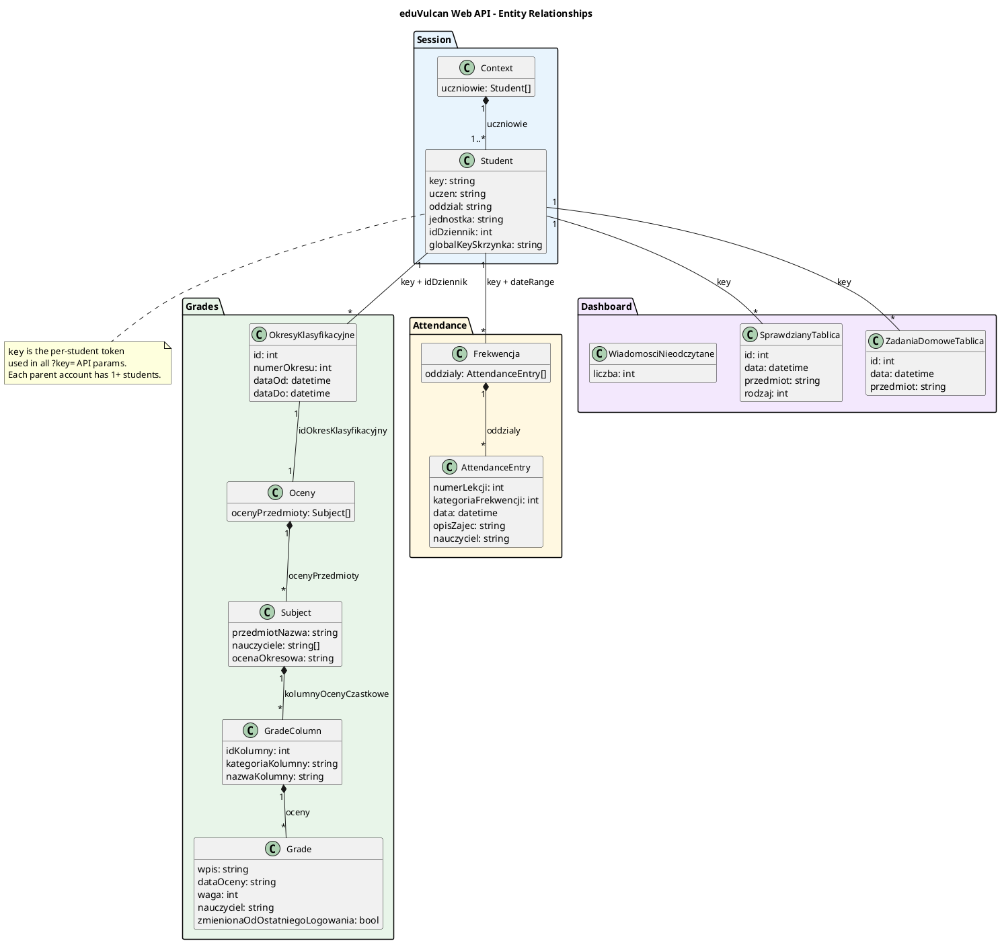

# eduVulcan web API reference

Reverse-engineered from the `uczen.eduvulcan.pl` SPA (March 2026).

## Authentication

The web API uses ASP.NET session cookies. No JWTs involved - the auth flow is WS-Federation (SAML XML tokens) between three domains:

1. `eduvulcan.pl` - main portal, handles login
2. `dziennik-logowanie.vulcan.net.pl/{tenant}` - federation service, issues security tokens
3. `uczen.eduvulcan.pl/{tenant}` - student dashboard, consumes tokens and sets session cookies

Key cookies for API access:
- `ASP.NET_SessionId` (on `uczen.eduvulcan.pl`)
- `Eduvulcan.Uczen.Sso` + `Eduvulcan.Uczen.Sso1` (XML security context tokens, split across two cookies)
- `X-V-RequestVerificationToken#...` (CSRF-like token)

The `tenant` is the school district identifier extracted from the dashboard URL (e.g. `exampledistrict`).

**Important:** the iris library's `register_by_jwt` endpoint expects JWTs, but eduVulcan no longer provides them through the web login flow. This project uses saved browser cookies instead.

## Base URL

```
https://uczen.eduvulcan.pl/{tenant}/api/
```

## Student context

### GET /api/Context

Returns all students linked to the logged-in parent account.

```json
{
  "uczniowie": [
    {
      "key": "BASE64_ENCODED_STUDENT_KEY",
      "uczen": "Jan Kowalski",
      "oddzial": "3A",
      "jednostka": "Szkola Podstawowa nr 1",
      "idDziennik": 1001,
      "idJednostkaSkladowa": 1,
      "globalKeySkrzynka": "aaaaaaaa-bbbb-cccc-dddd-eeeeeeeeeeee",
      "aktywny": true,
      "opiekunUcznia": true
    }
  ]
}
```

The `key` field is the per-student token used as `?key=` parameter in all subsequent API calls. Each parent account can have multiple students.

## Grades

### GET /api/OkresyKlasyfikacyjne?key={key}&idDziennik={idDziennik}

Returns classification periods (semesters). Required before fetching grades.

```json
[
  {"id": 1001, "numerOkresu": 1, "dataOd": "2025-09-01T...", "dataDo": "2026-01-31T..."},
  {"id": 1002, "numerOkresu": 2, "dataOd": "2026-02-01T...", "dataDo": "2026-08-31T..."}
]
```

### GET /api/Oceny?key={key}&idOkresKlasyfikacyjny={periodId}

Returns all grades for a student in a given period. Grouped by subject.

```json
{
  "ocenyPrzedmioty": [
    {
      "przedmiotNazwa": "Edukacja wczesnoszkolna",
      "pozycja": 1,
      "nauczyciele": ["Nowak Anna [AN]"],
      "srednia": null,
      "ocenaOkresowa": " ",
      "proponowanaOcenaOkresowa": " ",
      "kolumnyOcenyCzastkowe": [
        {
          "idKolumny": 100001,
          "kategoriaKolumny": "Biezace",
          "nazwaKolumny": "Sprawdzian 1",
          "oceny": [
            {
              "wpis": "5p",
              "dataOceny": "26.01.2026",
              "waga": 1,
              "kolorOceny": 0,
              "nauczyciel": "Nowak Anna [AN]",
              "zmienionaOdOstatniegoLogowania": false,
              "idOcenaPoprawiona": null
            }
          ]
        }
      ]
    }
  ]
}
```

Grade structure: `Oceny -> Subject -> GradeColumn -> Grade`. The `zmienionaOdOstatniegoLogowania` flag indicates whether a grade changed since the last login - useful for change detection.

## Attendance

### GET /api/Frekwencja?key={key}&dataOd={isoDate}&dataDo={isoDate}

Returns attendance records for a date range. Dates are ISO 8601 with timezone offset.

```json
{
  "oddzialy": [
    {
      "idPoraLekcji": 37,
      "numerLekcji": 5,
      "kategoriaFrekwencji": 1,
      "data": "2026-03-09T00:00:00+01:00",
      "opisZajec": "Przyroda",
      "nauczyciel": "Wisniewski Tomasz",
      "godzinaOd": "2026-03-09T11:45:00+01:00",
      "godzinaDo": "2026-03-09T12:30:00+01:00"
    }
  ]
}
```

`kategoriaFrekwencji` values (observed): 1 = present, 2 = absent. Other values (late, excused) need further observation.

### GET /api/FrekwencjaStatystyki?key={key}&idPrzedmiot={id}

Attendance statistics. Use `idPrzedmiot=-1` for all subjects.

### GET /api/Usprawiedliwienia?key={key}&dataOd={isoDate}&dataDo={isoDate}

Excuse requests for the given date range.

## Dashboard summaries (Tablica endpoints)

These are lightweight endpoints used by the dashboard. Good for polling since they return minimal data.

### GET /api/OcenyTablica?key={key}

Recent grade changes. Returns `[]` when no recent changes.

### GET /api/FrekwencjaTablica?key={key}

Recent attendance changes.

```json
{
  "oddzialy": [...],
  "dziennikiZajecInnych": []
}
```

### GET /api/SprawdzianyTablica?key={key}

Upcoming exams/tests.

```json
[
  {"id": 10001, "data": "2026-03-16T...", "przedmiot": "Przyroda", "rodzaj": 2}
]
```

`rodzaj`: 1 = test (sprawdzian), 2 = quiz (kartkowka) - needs verification.

### GET /api/ZadaniaDomoweTablica?key={key}

Upcoming homework.

```json
[
  {"id": 10002, "data": "2026-03-16T...", "przedmiot": "Plastyka"}
]
```

### GET /api/WiadomosciNieodczytane

Unread message count (not per-student, account-level).

```json
{"liczbaWiadomosciNieodczytanych": 214}
```

### GET /api/OgloszeniaTablica?key={key}

Announcements. Returns `[]` when none.

### GET /api/UsprawiedliwieniaTablica?key={key}

Excuse overview.

### GET /api/WychowawcyTablica?key={key}

Homeroom teachers.

```json
[{"imieNazwisko": "Kowalczyk Maria", "isGlowny": true, "globalKeySkrzynka": "..."}]
```

### GET /api/Uwagi?key={key}

Student notes/remarks. Returns `[]` when none.

## Other endpoints

### GET /api/PoryLekcji?key={key}

Lesson time slots for the school.

### GET /api/Przedmioty?key={key}

List of subjects.

### GET /api/DniWolne?key={key}&dataOd={isoDate}&dataDo={isoDate}

School holidays/days off.

### GET /api/PlanZajecTablica?key={key}

Today's schedule.

### GET /api/KomunikatStartowy

System-wide announcements. Returns `[]` when none.

## Entity relationships



![eduVulcan Web API Entity Relationships](https://www.plantuml.com/plantuml/svg/fLPBQzj04BxlhrZKMq92JL983QK9iLr2GbpYqa1A3wFTYRsMj2kqArofvBztzFJALauzIPxvvltDoDVMGURo96PEkHWvolnd7WlG_1b3VlFzZf_nkIPTmPym1gUCjXkLMcOZfLF88E4Y1cjldCjKc3ky4qQlL8dyuo5aORIhDPCBJvM2Y62DU-KbsoX9YIGfnKpGROoqZBKm7gpGMaeYu1_cLulBnOp_PRpnps_91_vnjOJpN9HQcPt2AL-vNA9sltwJuetr-5RSuYCifjnI5NhTsQCUI8oKfO9u8DkYrCQw20PI9MUbGgrLDELAkrgsZaq8yJqMgoWh2psmU6DlNedVCf1ecme_pJzx5IwZ36rnJ-_5guf055kDRVfAxaFfFC6inkPxeGG7ImBH4vrAi1VEp43eDMWfK1UjVrEzVyzAb8aoZbgroiCjYkEcDkBMAkqC7g7S3NkaWJfS28KnTlBQLnCAwlJDRjYbFahTebiJvudkwx-lVnRxYYCgQcqo1Rrc49uIEbOSncYzxr9b1-PrDwkM3AGxM8CtXhx20QXCY1f4OPh6ahRFQKLPFfWr5QiLcOV6n4USeFr2BK4B95ui5ekh-SJZnIB3Q8TQRA6RLaDLocvlI6kS5OVZEb2tvZM17Z0IMpNIpZwQ6hBhW5k6UlO2H8Ptnluk_sTWDw61J5QbNj0I-4k-IZFOLSNfuWU4iH8miW0ZsVHC76IJ6Ld2jZFq-l82ifh6p2HcX_yTo7Fyh42IKolKeq8ZgHSE-YMcA6K8-tJ8hZjgmIJW9sTdz3m_FmdwspNTtpdMoIfeXIJOwC6OLhUEdtfNYetYEZ_qQ2u19IPhv01Oi4RRPrYbrrw1wU7TO9t6H_lRJCarIraxlIs1ZYkDWFcO8zikpbWBlDte2g_czGHwZSnJ-auFjsBQBzHOX15Arf76iAEyQj1C6uUq_SwPX9lNRiH4X20WVH1mPRdR84ynExEjQsSYr0J9BKgY3OSuvby9_QN-TjUVM7jE-Zc8JVMpiW4XJ4xF3LW-EUMjAu9HpRnAWbtJ6_qd-0S0)

## Messages (separate subdomain)

Messages live on `wiadomosci.eduvulcan.pl/{tenant}/api/`, not on the main `uczen.eduvulcan.pl` domain. The inbox is unified across all students - the `skrzynka` field on each message indicates which child's mailbox it belongs to.

### GET /api/Skrzynki

Returns mailboxes for all students. The `globalKey` matches `globalKeySkrzynka` from the Context endpoint.

```json
[
  {"globalKey": "aaaaaaaa-...", "nazwa": "Parent Name - R - Child Name - (School)", "typUzytkownika": 2},
  {"globalKey": "bbbbbbbb-...", "nazwa": "Parent Name - R - Other Child - (School)", "typUzytkownika": 2}
]
```

### GET /api/LiczbyNieodczytanych

Unread count per mailbox.

```json
[
  {"globalKey": "aaaaaaaa-...", "liczbaWiadomosci": 150},
  {"globalKey": "bbbbbbbb-...", "liczbaWiadomosci": 64}
]
```

### GET /api/Odebrane?idLastWiadomosc={lastId}&pageSize={n}

Received messages, paginated. Use `idLastWiadomosc=0` for the first page.

```json
[
  {
    "id": 379162,
    "apiGlobalKey": "646d3311-...",
    "korespondenci": "Kieca Anna - P - (School)",
    "temat": "Message subject",
    "data": "2026-03-15T11:02:41.183+01:00",
    "skrzynka": "Parent Name - R - Child Name - (School)",
    "hasZalaczniki": false,
    "przeczytana": false,
    "wazna": false,
    "uzytkownikRola": 2,
    "wycofana": false,
    "odpowiedziana": false,
    "przekazana": false
  }
]
```

### GET /api/WiadomoscSzczegoly?apiGlobalKey={uuid}

Full message detail including HTML content.

```json
{
  "id": 379162,
  "apiGlobalKey": "646d3311-...",
  "nadawca": "Kieca Anna - P - (School)",
  "odbiorcy": ["Parent Name - R - Child Name - (School)"],
  "temat": "Message subject",
  "tresc": "<p>HTML message content</p>",
  "data": "2026-03-15T11:02:35+01:00",
  "odczytana": false,
  "zalaczniki": []
}
```

### GET /api/Cache

Shared configuration for the messages app.

### GET /api/Stopka

Email signatures per mailbox.

## Polling strategy

For change detection, prefer the `*Tablica` (dashboard) endpoints - they're lightweight and designed for the dashboard to poll. The full endpoints (e.g. `/api/Oceny`, `/api/Frekwencja`) should be used sparingly to get detail when a change is detected.

Recommended approach:
1. Fetch `/api/Context` once per session to get student keys
2. For each student, poll `OcenyTablica`, `FrekwencjaTablica`, `SprawdzianyTablica`, `ZadaniaDomoweTablica`, `OgloszeniaTablica` on interval
3. When a dashboard endpoint shows new data, optionally fetch the full endpoint for details
4. Hash responses for deduplication (same approach as the original differ)

## Open questions

- Exact mapping of `kategoriaFrekwencji` values (only observed 1=present, 2=absent so far)
- `rodzaj` values in SprawdzianyTablica (1=test? 2=quiz?)
- Session cookie expiry duration (observed to survive at least a few minutes; longer-term testing needed)
- Pagination: does `idLastWiadomosc` work for fetching older messages beyond the first page?
