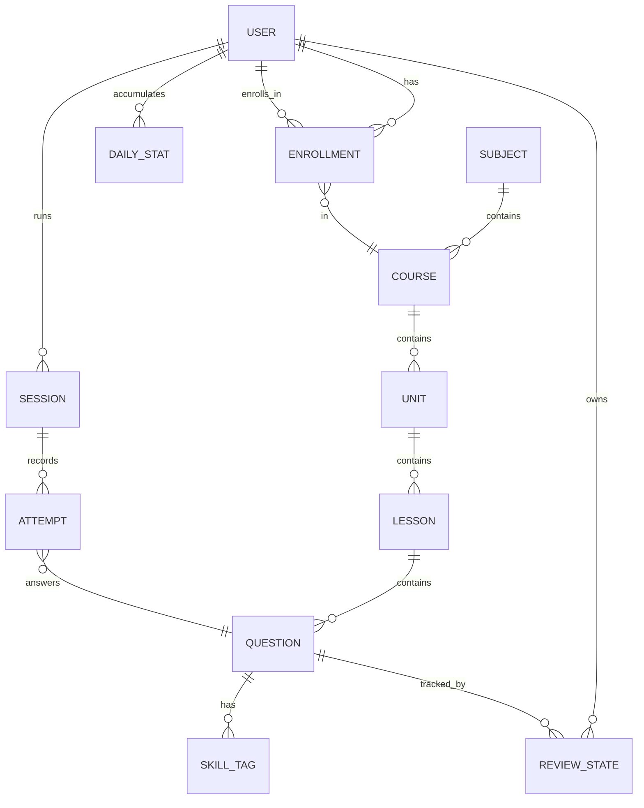
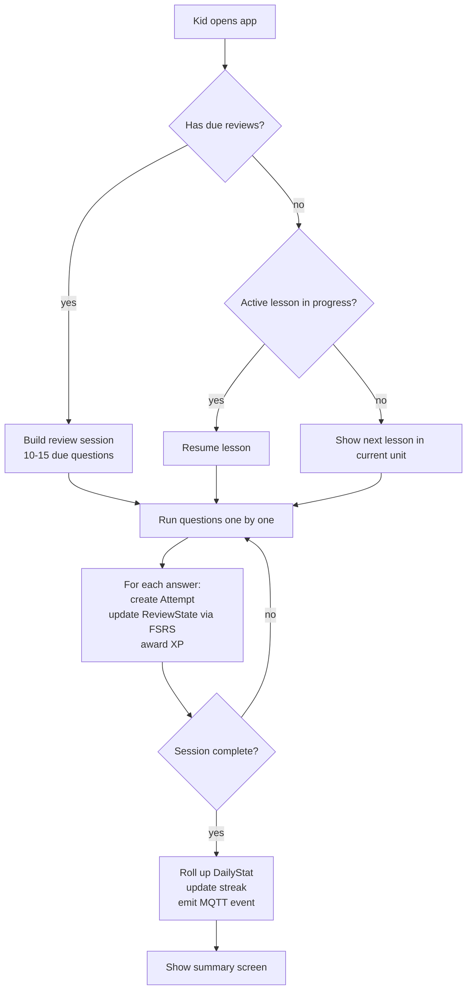
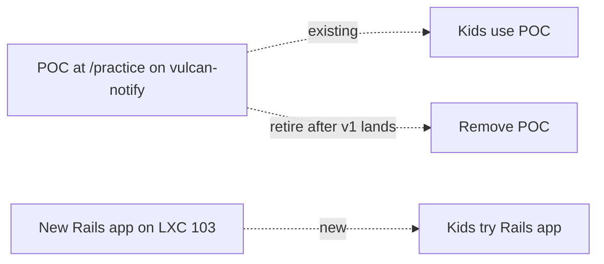

# Practice MVP plan

POC → MVP migration for the kids' practice app. Goal: a Duolingo-lite that you'll actually keep using and extending across subjects, not a one-off science project.

## Why migrate at all

The vanilla-JS POC inside `vulcan-notify` already works. Reasons to move:

- **Per-question state per kid**: localStorage doesn't survive device switches and can't drive a parent dashboard
- **Spaced repetition + mastery**: needs a real DB and a per-user scheduling table
- **Multi-subject growth**: math + Polish + English + history with a shared engine, not per-subject hardcoded sets
- **Streaks + XP that mean something**: server-tracked, not localStorage-faked
- **You want to build and learn Rails**: stated preference, fine reason

Reasons NOT to migrate yet:

- The kids haven't actually used it for more than a week
- POC works; rebuilding is real work that delays kids using it daily
- Adding subjects is cheap with the current JSON schema

**Recommendation**: Run the POC for 2-3 weeks first. If the kids use it daily, migrate. If they bounce off, the lesson is "fix the loop," not "rebuild the stack."

## North star: what does v1.0 look like

A kid opens an iPad, taps her name, sees:

- Today's streak (5 days, with a weekly calendar strip)
- XP for today + level progress bar
- "Continue learning" CTA showing the next due review session OR new lesson
- Optional: "Free practice" button to pick a topic

She does a 5-15 min session, gets XP, sees streak go up, gets a "great job" animation. You get a push notification on your phone via Home Assistant: "Solomiia did 12 questions in math, struggled with decimal-to-fraction conversion."

That's it. Not a learning platform — a habit machine for two kids.

## Stack decisions

| Decision         | Choice                                              | Why                                                                 |
| ---------------- | --------------------------------------------------- | ------------------------------------------------------------------- |
| Framework        | Rails 8                                             | User preference; Solid stack means zero external deps               |
| Database         | SQLite + Litestream for backup                      | 2 users, no contention; trivial backup; migrate to Postgres if ever |
| Background jobs  | Solid Queue                                         | Comes with Rails 8, runs in same process                            |
| Cache + Cable    | Solid Cache, Solid Cable                            | Same reason                                                         |
| Frontend         | Hotwire (Stimulus + Turbo Frames) + vanilla JS      | Keep the existing keypad as a Stimulus controller; no SPA needed    |
| Math rendering   | KaTeX (CDN) — same as POC                           | Already works                                                       |
| Spaced repetition| `fsrs` gem (FSRS algorithm)                         | Modern SM-2 successor, maintained                                   |
| Content storage  | YAML files in `db/content/`, seeded into DB         | Author in editor; validated on load; hot-reload in dev              |
| Auth             | Rails 8 built-in `has_secure_password` + cookie session | 2 users on a trusted LAN; PIN-style login; no Devise needed     |
| Deploy           | Kamal 2 to LXC 103                                  | Zero-downtime deploys for mid-session resilience                    |
| Parent dashboard | Home Assistant via MQTT events from Rails           | HA already has Lovelace, history, push to phone                     |
| PWA              | Rails 8 PWA scaffold + service worker for offline   | iPad install-to-home-screen; offline practice mode                  |

## Domain model



Tables (sketched, not exhaustive):

- **users** — id, name, pin_digest, current_skin, created_at
- **subjects** — id, slug, name, icon (e.g., "math", "polish")
- **courses** — id, subject_id, slug, title, level (e.g., "Math · Klasa 4")
- **units** — id, course_id, slug, title, position
- **lessons** — id, unit_id, slug, title, position, estimated_minutes
- **questions** — id, lesson_id, slug, type, payload (JSON), difficulty
- **skill_tags** — many-to-many between questions and skills (e.g., "fraction-reduction")
- **enrollments** — user_id, course_id, started_at
- **sessions** — id, user_id, started_at, ended_at, xp_earned, mode (lesson|review|free)
- **attempts** — id, session_id, question_id, correct, answer_value, attempts_count, time_ms
- **review_states** — id, user_id, question_id, fsrs_state (JSON), due_at, last_reviewed_at
- **daily_stats** — id, user_id, date, xp_earned, questions_answered, accuracy, time_spent_minutes
- **streaks** — id, user_id, current_length, longest_length, last_active_date

`questions.payload` is the JSON that today lives in `practice/sets/*.json` — same shape, same renderers. The schema doesn't care if it's mcq or numeric or matching.

## Content authoring workflow

Files live in `db/content/`:

```
db/content/
  subjects/
    math.yml          # subject metadata
    polish.yml
  courses/
    math-klasa-4.yml
  lessons/
    math-klasa-4/
      ulamki-zwykle-1.yml
      ulamki-dziesietne-1.yml
```

Each YAML has front-matter (title, position, skill tags) and a list of questions with the same payload schema as the current JSON.

Workflow:

1. Edit a YAML in your editor (or Claude does)
2. Dev server's `Listen` watcher detects the change
3. `ContentLoader` validates against `dry-schema`, upserts via `rake content:seed`
4. Refresh browser — new content is live
5. On deploy, Kamal runs the same seed task as a release command

No CMS. No web admin for content. Authoring stays in git.

## Engine: how a session actually runs



FSRS handles the "when does this question come back" calculation. Per-skill mastery is derived: a skill is mastered at X% when the kid's last N attempts on questions tagged with that skill are >= Y% correct.

## Parent dashboard via Home Assistant

Rails publishes MQTT events on key moments:

- `practice/<student>/session/started`
- `practice/<student>/session/completed` — payload: xp, accuracy, skills_practiced, weakest_skill
- `practice/<student>/streak/extended`
- `practice/<student>/streak/lost`
- `practice/<student>/lesson/completed`
- `practice/<student>/level/up`

HA does the rest:

- Lovelace card showing today/week/month stats per kid
- History graph of XP per day
- Automation: weekly summary push every Sunday evening
- Automation: alert if a kid hasn't practiced by 8pm on a school day (only if you want — easy to disable)

Rails admin section stays minimal: reset streak (mercy mode), view detailed mistake log per kid, content sanity-check page.

## Scope: what's in v1.0 vs deferred

### v1.0 (MVP — ship in ~3-4 weekend chunks of work)

- Auth: 2 users, PIN login (4-digit, no password)
- Subjects + courses + units + lessons + questions, all from YAML
- All 7 question types from the POC (mcq, multi-mcq, numeric, ordering, truefalse, matching, numberline) reused as Stimulus controllers
- Custom keypad ported as-is
- Skin system ported (4 skins, per-user)
- Sessions: lesson mode + review mode
- FSRS-based review scheduling
- XP + daily streak + simple level progression
- Daily stats roll-up
- MQTT events to HA
- Service worker for offline practice (cache last 50 due questions)
- iPad install-to-home-screen instructions

### v1.1 (close follow-ups — within ~1 month after v1.0)

- Skill-level mastery view ("you're 80% on fraction reduction, 30% on long division")
- "Mistakes" deck — questions you got wrong recently as a separate session mode
- Sound effects + haptics on correct/incorrect
- Bigger streak celebrations (confetti, milestone screens at 7/30/100 days)

### Deferred (not v1, maybe never)

- Drag and drop interactions (you said skip)
- Audio questions (recording your voice for Polish dictation)
- Multi-device sync beyond your LAN
- Social features (no, just no)
- Public hosting
- Content admin UI
- Multi-tenant for other families

## Migration sequencing

Don't rebuild and switch over in one big bang. Run them side by side until the new one is better.



**Phase 0** — POC stays live. Kids use it for 2-3 weeks while you build.

**Phase 1** — Rails skeleton on LXC 103, separate subdomain (e.g., `practice.dwelf-forel.ts.net` vs the current `tools.dwelf-forel.ts.net/practice`). Empty app, just deploys, has auth.

**Phase 2** — Port the question types as Stimulus controllers. Hardcode one lesson with one question of each type. Verify on iPad.

**Phase 3** — Domain model + content loader. Migrate one existing JSON set to YAML, run a session against it.

**Phase 4** — Sessions, attempts, FSRS, XP, streak. Everything stays in the Rails app, no MQTT yet.

**Phase 5** — MQTT events + HA dashboard cards. Replace the POC's parent visibility (which is zero) with real dashboards.

**Phase 6** — Service worker, PWA install, polish. Switch the family default URL to the Rails app. Remove the POC route from `vulcan-notify`.

Estimate: 3-5 evenings per phase if you have momentum, more if not. Total: ~25-40 hours of focused work.

## Risks

- **You'll over-engineer it.** The temptation to build "a real platform" will be strong. Resist. Two kids. One LAN. Keep it boring.
- **FSRS without enough attempt data is just a random scheduler.** Be patient — needs ~30+ attempts per question per kid before it stabilizes. Use simple "wrong answers come back tomorrow" as a fallback for the first month.
- **Hot-reload of YAML in dev is fragile.** If it gets weird, drop it and use a file watcher that just kicks `rake content:seed` on change. No magic.
- **Kamal on a non-cloud target has port conflicts.** Plan to either let Kamal own the proxy (if the LXC isn't running anything else on 80/443) or expose the app on a high port and let your existing reverse proxy front it. Decide before phase 1 to avoid rework.
- **iOS PWA quirks.** Web Push works in iOS 16.4+ only when installed to home screen. Service worker behavior is subtler than Android — test on a real iPad early, not just desktop Chrome.
- **You'll never finish if there's no deadline.** Pick a "kids' practice deserves a real app" date and ship by it.

## Open questions for you (answer when you decide)

1. **Repo strategy**: new repo (`practice` or `kid-practice`) or monorepo with `vulcan-notify`? I'd recommend separate repo — different lifecycle, different stack.
2. **Subdomain**: `practice.dwelf-forel.ts.net` or path-based on existing domain?
3. **Subjects to seed first**: math (already have content), Polish (large addressable surface), English (kids need it most)?
4. **Kid PIN management**: do they pick their own, or you set them? (4 digits, easy to remember)
5. **"Required minimum" per day**: any concept of "you have to do at least 10 questions" or pure carrot, no stick?
